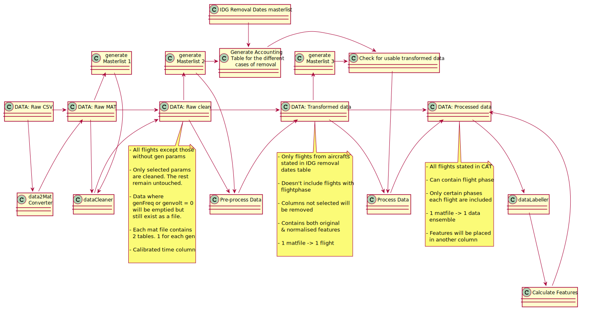
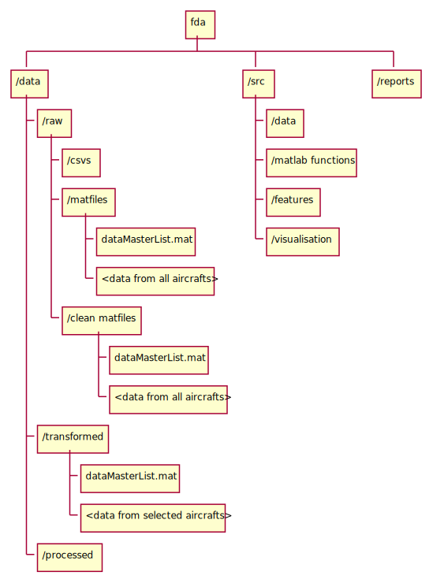

# FDA Project
---
The aim of this project is to find, if not, design, features from the flight data parameters in order to detect a generator failure ahead of time.

## Contents

-   [Project Dependencies](#Project-Dependencies)
-   [Information about the data used](#Information-about-the-data-used)
-   [Data Pipeline](#Data-Pipeline)
-   [File Structure](#Folders)
-   [Getting started](#Getting-started)
    -   [Set up](#Setting-up-the-project-and-global-filepaths)
    -   [Code Snippets](#Code-snippets)
-   [Scripts](#Scripts)
    -   [View the dataMasterList](#View-the-dataMasterList)
    -   [Iterating through flight data within a certain range of dates in the dataMasterList](#Iterating-through-flight-data-within-a-certain-range-of-dates-in-the-dataMasterList)

## Project Dependencies

-   MATLAB
-   Predictive Maintenance Toolbox
-   Parallel Computing Toolbox
-   Statistics and Machine Learning Toolbox

## Information about the data used

This part describes the raw data.

-   1 csv file for each flight. 
-   All flights are grouped by date. The csv files for each day are numbered in reverse chronological order. For example, if there were 7 flights that day, the first flight that day will be numbered "7.csv", followed by "6.csv" and so on.

### Column Description

The table below describes some of the columns in the raw data that were used for analysis. Due to some discrepancies, some tables might not have certain columns.

#### Generator Parameters
Column Name             | Description                                                                                              | Status                                        
- | - | -
 `INLET TEMP`              | The temperature of the oil coolant before it enters the IDG system (in degrees celcius)                  | Present in all raw data                       
 `OUTLET TEMP`             | The temperature of the oil coolant as it exits the IDG system (in degrees celcius)                       | Present in all raw data                       
 `GENFREQ/GENFREQ`         | The output frequency of the AC power(Hz).                                                                | Present in all raw data                       
 `GEN VOLTAGE/GEN VOLTAGE` | The output AC voltage of the generator                                                                   | Present in all raw data

#### Derived Generator Parameters
 Column Name             | Definition    
- | - 
`IDGTEMPDIFF` | `Outlet temp - inlet temp` 
`IDGVHZRATIO` | `GENVOLTAGE / GENFREQ`

#### Other Parameters
 Column Name             | Description                                                                                              | Status                                        
- | - | -
 SfCount                 | Subframe number. Subframes are sent at a rate of 1 Hz and each contains an entire _row_ of data.         | Present in all raw data                       
 Flight Phase            | A number from 1-14, defined as per SAGEM's protocols. Describes the stage of the flight the plane is at. | Not all raw data contains flight phase        
 Barometric Altitude     | Altitude measured using barometer                                                                        | Not all raw data contains Barometric altitude 
 Calibrated Air Speed    | Speed(recorded in knots/s)                                                                               | Not all raw data contains speed
 N1/N2 Eng 1/2           | The power (Expressed as percentage) of the turbines that turn the generator.                             | Not all raw data contains Engine details      

## Data Pipeline

<!--
```
@startuml dataPipeline

"DATA: Raw CSV" -right-> "DATA: Raw MAT"
"DATA: Raw MAT" -right-> "DATA: Raw clean"
note bottom
- All flights except those
  without gen params
  
- Only selected params 
  are cleaned. The rest
  remain untouched.
  
- Data where
  genFreq or genvolt = 0
  will be emptied but
  still exist as a file.

- 1 matfile -> 1 flight
  -> 2 tables
  (At least 9 columns each)

- Calibrated time column

end note
"DATA: Raw clean" -right-> "DATA: Transformed data"
note bottom
- Only flights from aircrafts
  stated in IDG removal
  dates table

- Doesn't include flights without 
  flightphase
  
- Columns not selected will 
  be removed
  
- Contains both original 
  & normalised features. Even
  empty tables will have the
  same columns as the rest
  
  
- 1 matfile -> 1 flight
  -> 2 timetables
  (37 columns each)

end note
"DATA: Transformed data" -right-> "DATA: Processed data"
note bottom
- All flights stated in CAT
  
- Can contain flight phase

- Only certain phases
  each flight are included

- 1 matfile -> 1 data 
  ensemble
  
- Features will be placed
  in another column
end note
"DATA: Raw CSV" -down-> "data2Mat\n Converter"
"data2Mat\n Converter" -up-> "DATA: Raw MAT"


"DATA: Raw MAT" -up-> "generate\n Masterlist 1"
"DATA: Raw MAT" -down-> "dataCleaner"
"dataCleaner" -up-> "DATA: Raw clean"
"generate\n Masterlist 1" -down-> "dataCleaner"

"DATA: Raw clean" -down-> "Pre-process Data"
"Pre-process Data" -up-> "DATA: Transformed data"
"DATA: Raw clean" -up-> "generate\n Masterlist 2"

"generate\n Masterlist 2" -down-> "Pre-process Data"
"DATA: Transformed data" -down-> "Process Data"
"Process Data" -up-> "DATA: Processed data"

"DATA: Transformed data" -up-> "generate\n Masterlist 3"
"IDG Removal Dates masterlist" -down-> "Generate Accounting\n Table for the different\n cases of removal"
"generate\n Masterlist 2" -right-> "Generate Accounting\n Table for the different\n cases of removal"
"generate\n Masterlist 3" -right-> "Check for usable transformed data"
"Generate Accounting\n Table for the different\n cases of removal" -right-> "Check for usable transformed data"


"Check for usable transformed data" -down-> "Process Data"
"DATA: Processed data" -down->  "dataLabeller"
"dataLabeller" -down-> "Calculate Features"
"Calculate Features" -up-> "DATA: Processed data"

@enduml
```
-->




The diagram above shows the processes used on the data. Boxes with "DATA: ..." depict the data while the rest are subprocesses. The table below describes each form of data. **For more information about the column naming, file naming and conversion steps, please consult the PPT slides, "Data Pipeline Documentation.ppt".**

Data Form | Description
-|-
Raw CSV |- The original immutable data.<br>- 1 csv for 1 flight
Raw MAT |- Contains the same amount of data as its CSV counterpart but it's in MAT-file format<br>- No columns are removed<br>- Date columns are formatted, if available.<br>- 1 matfile for 1 flight
Raw clean | New columns are calculated:<br>- `IDGTEMPDIFF = OUTLETTEMP - INLETTEMP`<br>- `IDGVHZRATIO = GENVOLTAGE / GENFREQ` <br>The selected columns are cleaned.<br>**For categorical data**:<br>- the rows containing dat outside the permissible range are deleted.<br><br>**For numerical data**:<br>- The rows with data outside the permissible range are replaced with a linear interpolation of data from the adjacent rows.<br>- 1 matfile for 1 flight<br>- Each matfile contains 2 variables: `gen1` & `gen2` which contains cleaned parameters of that generator<br><br>The following is the **logic for cleaning**:<br>- `GENFREQ > 0` & `GENVOLTAGE > 0`<br>- `1 <= FLIGHTPHASE <= 14`<br>- When `GENFREQ > 0`, `TEMPDIFF > 0`<BR>~~- Remove local outliers $\ge$ 1.5 STD from the mean, with a moving window of 15.~~
Transformed data  |- The selected columns are retained, while the rest are removed.<br>- Calculate the 1st \& 2nd derivative of each gen parameter.<br> - Feature normaliation carried out for each generator parameter \& its derivatives and is placed in a separate column.<br>- Each matfile contains 2 tables. One for each generator. The tables are obtained by first separating the data into those of generator 1 and those of generator 2. Then each table is filtered to remove those rows where generator frequency = 0 Hz.<br>- 1 matfile for 1 flight and **only flights from selected aircrafts are transformed.**
processed data|- 1 matfile for 1 **case**.<br>- Each matfile contains the [data ensemble]((https://www.mathworks.com/help/predmaint/ug/data-ensembles-for-condition-monitoring-and-predictive-maintenance.html)) for the case, along with some metadata. There will be matfiles with overlapping data<br>- Each matfile contains a single row of a table(shown below &darr;)
processed data (after calculating features)| Same format as processed data. In fact, they are the same files, but this time, it has a new column called "features"

General format of processed data
 \<metadata> | data  | features (only after feature calculation)
 ------------ | ------------------- |-
 \<metadata> | { 2810 x 56 table } | { 2810 x 596 table }


## Folders
<!--
```
@startwbs directoryStructure
* fda
** /data
*** /raw
**** /csvs
**** /matfiles
***** dataMasterList.mat
***** <data from all aircrafts>
**** /clean matfiles
***** dataMasterList.mat
***** <data from all aircrafts>
*** /transformed
**** dataMasterList.mat
**** <data from selected aircrafts>
*** /processed
** /src
*** /data
*** /matlab functions
*** /features
*** /visualisation
** /reports
@endwbs
```
-->




## Getting started

### Setting up the project and global filepaths
1) Change the `Conf.PATH_TO_DATA` in `src/matlab functions/config.m` below to the absolute filepath to the `src/data` folder on your computer. Example:
```octave
function Conf = config
%config Stores and returns IDG programme configurations
   
Conf = struct;

% Set the file paths to the data sets
Conf.PATH_TO_IDG_DATA = "C:\Users\13\Desktop\fda\data"; % edit this line for your computer
```

2) Double click on the _"fda.prj"_ file. Wait for it to load. **Every time prior to working on this project, you have to open this .prj file**.

> **NOTE**: If you don't have fda.prj, you can manually add the require folders to path using `addpath()`.
> Make sure the folders below are added to matlab path everytime prior to analysis:
> - `src/matlab functions`
> - `src/data`

### Updating the dataMasterLists
- Run the code snippet below to update all the file paths in the data master list to those matching your computer.

```octave
Conf = config;
generateFlightDataMasterList(Conf.PATH_TO_IDG_MATFILES, 1);
generateFlightDataMasterList(Conf.PATH_TO_IDG_RAW_CLEAN_DATA, 1);
generateFlightDataMasterList(Conf.PATH_TO_IDG_TRANSFORMED_DATA, 1);
```

<br>

### Code snippets

#### View the dataMasterList
Metadata about the tables is stored in a dataMasterList which the scripts will use to iterate through, instead of directly iterating through the files in the respective folders. The code below shows you how it looks like
```octave
try
	Conf = config;
catch
	disp("config function not found. Open the fda.prj file before continuing.")
    return
end

PATH_TO_IDG_MATFILES = Conf.PATH_TO_IDG_MATFILES
mat_file = load(fullfile(PATH_TO_IDG_MATFILES, "dataMasterList.mat"))
dataMasterList = mat_file.data
```
You should get a table that looks a bit like this &darr;. All the flights from a single aircraft are stored in a row, where the filepaths to the respective flight data are stored in the column called `data`. 
AIRCRAFT | NumFiles | data
-|-|-
BVC|1033|{1033 x 3 table}
... | .. | ...


Then run the snippet below to see what's inside `data`.
```octave
fprintf("Below are all the filepaths to the flight data for aircraft %s",dataMasterList.Aircraft(1))
dataMasterList.data{1}
```
The output should look something like the one below. Each flight is dated & numbered, with an absolute filepath to the file so the [next code snippet](#Iterating-through-flight-data-within-a-certain-range-of-dates-in-the-dataMasterList) can be run from anywhere [as long as this dataMasterList is updated](#Updating-the-dataMasterList).
date | Num | filepath
-|-|-
01-01-2020|3|"C:\\absolute file path to that file"
... | .. | ...

<br>
<br>
<br>

#### Iterating through flight data within a certain range of dates in the dataMasterList
You might not want to iterate through all the raw mat files but only those that fall within a range of dates. This code snippet does just that. Do remember to delete the `return` statement before running your code!
```octave
try
	Conf = config;
catch
	disp("config function not found. Open the fda.prj file before continuing.")
    return
end

PATH_TO_IDG_MATFILES = Conf.PATH_TO_IDG_MATFILES
mat_file = load(fullfile(PATH_TO_IDG_MATFILES, "dataMasterList.mat"))
dataMasterList = mat_file.data

latestDate = datetime("01-01-2020",'InputFormat',"dd-MM-uuuu");
earliestDate = datetime("31-01-2020",'InputFormat',"dd-MM-uuuu");


for row = 1:size(dataMasterList,1)
	aircraftData = dataMasterList(row,:);
    currentAircraft = aircraftData.Aircraft
    allFlightData = aircraftData.data{1};
    
    selectedFlightData = allFlightData(allFlightData.date >= earliestDate & allFlightData.date <= latestDate);
    
    selectedFlightDataFilepaths = selectedFlightData.filepath;
    
    for flight = 1:size(selectedFlightDataFilepaths,1)
    	singleFlightData = allFlightData(flight,:);
        filepath = singleFlightData.filepath;
        
        flight_matfile = load(filepath);
        
        flightData = flight_matfile.tbl
        
        % Your code here
        return
        
    end
end
```
<br>

## Scripts
---
### Converting from Raw CSV &rarr; Raw MAT
```octave
run("data2MatConverter2020.mlx");
run("data2MatConverter.mlx");
```
-   Run these in the matlab command line to generate a copy of all csvs in MAT-file format, in case you lost all your matfiles or corrupted any. It takes **2 hours** to finish running. Make sure you completed the [Setting up the project and global filepaths](#Setting-up-the-project-and-global-filepaths) section before running any command in this section.
-   This script converts all existing csv files in the data/raw/csvs folder into matfiles and store them in the data/raw/matfiles folder.
-   It avoids duplicates and groups all matfiles by aircraft, storing them in the same folder.
-   Does not overwrite existing files with the same name. If you wish to overwrite, you have to delete the file first.

### Updating the dataMasterList
```octave
Conf = config;
generateFlightDataMasterList(Conf.PATH_TO_IDG_MATFILES, 1);
generateFlightDataMasterList(Conf.PATH_TO_IDG_RAW_CLEAN_DATA, 1);
generateFlightDataMasterList(Conf.PATH_TO_IDG_TRANSFORMED_DATA, 1);
```
-   This script creates/updates the dataMasterList.mat, which maps each flight data matfile to its corresponding absolute filepath.
-   The resulting dataMasterList.mat can be used for finding and processing matfiles.

# TODO

 Task | Assigned to | Status
 - | - | -
Try out normalisation by variable | 
Try out autoencoder|

